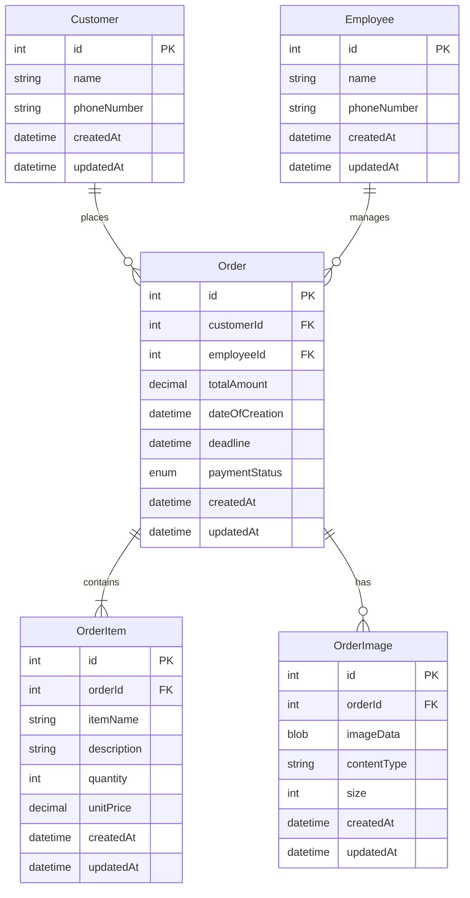

# Boutique Order Management System Architecture

## Architecture Overview
1. Frontend: React Single Page Application with component-based architecture
2. Backend: RESTful API service with a relational database (sqlite)
3. File Storage: Separate service/storage for order images

## Backend Architecture

### Core Entities
1. Customer
2. Order
3. OrderItem (nested within Order)
4. Employee
5. Image references

### API Endpoints Structure

#### Customers
* GET /api/customers - List all customers
* GET /api/customers/{id} - Get specific customer
* POST /api/customers - Create new customer
* PUT /api/customers/{id} - Update customer
* DELETE /api/customers/{id} - Delete customer

#### Orders
* GET /api/orders - List all orders (with filters for status, date range)
* GET /api/orders/{id} - Get specific order
* POST /api/orders - Create new order
* PUT /api/orders/{id} - Update order
* DELETE /api/orders/{id} - Delete order
* PUT /api/orders/{id}/status - Update payment status
* POST /api/orders/{id}/images - Upload order images
* DELETE /api/orders/{id}/images/{imageId} - Delete specific image

#### Employees
* GET /api/employees - List all employees
* GET /api/employees/{id} - Get specific employee
* POST /api/employees - Create new employee
* PUT /api/employees/{id} - Update employee
* DELETE /api/employees/{id} - Delete employee

## Frontend Views/Components

### Dashboard View
* Overview of recent orders
* Quick stats (pending orders, total orders, etc.)
* Quick access to create new order

### Orders Management
* Orders list view with filters (status, date, employee)
* Order detail view
* Order creation/edit form
* Image upload/gallery component
* Payment status update interface

### Customer Management
* Customers list view with search
* Customer detail view
* Customer creation/edit form
* Customer orders history

### Employee Management
* Employees list view
* Employee detail view
* Employee creation/edit form
* Employee workload view

### Shared Components
* Navigation/sidebar
* Search components
* Filter components
* Form components
* Image upload/preview components
* Status badges/indicators

## Technologies to use
### Frontend
 * React
 * Shadcn for components
 * Tailwind for styling
 * React Router for routing
 * Typescript

### Backend
 * NextJS
 * sqlite for database inclding images
 * Typescript

## Database Schema

### Mermaid graph

